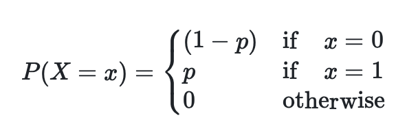

# Generating Bernoulli random variables

We are now going to try to write a program to generate Bernoulli random variables.  Remember the probablity mass function for a Bernoulli random variable, X, is given by:

To complete this exercise you are going to need to use all the ideas that we have covered in the other parts of these programming exercise as:

- I want you to write a function called `bernoulli` that takes in a parameter called `p`.  This parameter gives the probability that the trial is successful - and that the function thus returns a 1.

- Within your function called `bernoulli` you will need to generate a uniform random variable using the `np.random.uniform function` that we learned about in the previous exercise.
 
- You will then need to use a conditional (if) statement to decide whether the program should return a 1 (indicating that the trial was successful) or a 0 (indicating that the trial was a failure).  This decision on whether the trial was a success or a failure will be made based on the value obtained when you generated your uniform random variable. 

For an explanation of how this function should work see [this video](https://www.youtube.com/watch?v=WJcuKYJK6rw)
